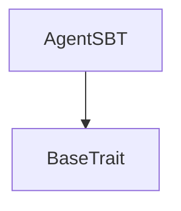

# Tact compilation report
Contract: AgentSBT
BoC Size: 1467 bytes

## Structures (Structs and Messages)
Total structures: 34

### DataSize
TL-B: `_ cells:int257 bits:int257 refs:int257 = DataSize`
Signature: `DataSize{cells:int257,bits:int257,refs:int257}`

### SignedBundle
TL-B: `_ signature:fixed_bytes64 signedData:remainder<slice> = SignedBundle`
Signature: `SignedBundle{signature:fixed_bytes64,signedData:remainder<slice>}`

### StateInit
TL-B: `_ code:^cell data:^cell = StateInit`
Signature: `StateInit{code:^cell,data:^cell}`

### Context
TL-B: `_ bounceable:bool sender:address value:int257 raw:^slice = Context`
Signature: `Context{bounceable:bool,sender:address,value:int257,raw:^slice}`

### SendParameters
TL-B: `_ mode:int257 body:Maybe ^cell code:Maybe ^cell data:Maybe ^cell value:int257 to:address bounce:bool = SendParameters`
Signature: `SendParameters{mode:int257,body:Maybe ^cell,code:Maybe ^cell,data:Maybe ^cell,value:int257,to:address,bounce:bool}`

### MessageParameters
TL-B: `_ mode:int257 body:Maybe ^cell value:int257 to:address bounce:bool = MessageParameters`
Signature: `MessageParameters{mode:int257,body:Maybe ^cell,value:int257,to:address,bounce:bool}`

### DeployParameters
TL-B: `_ mode:int257 body:Maybe ^cell value:int257 bounce:bool init:StateInit{code:^cell,data:^cell} = DeployParameters`
Signature: `DeployParameters{mode:int257,body:Maybe ^cell,value:int257,bounce:bool,init:StateInit{code:^cell,data:^cell}}`

### StdAddress
TL-B: `_ workchain:int8 address:uint256 = StdAddress`
Signature: `StdAddress{workchain:int8,address:uint256}`

### VarAddress
TL-B: `_ workchain:int32 address:^slice = VarAddress`
Signature: `VarAddress{workchain:int32,address:^slice}`

### BasechainAddress
TL-B: `_ hash:Maybe int257 = BasechainAddress`
Signature: `BasechainAddress{hash:Maybe int257}`

### ChangeOwner
TL-B: `change_owner#819dbe99 queryId:uint64 newOwner:address = ChangeOwner`
Signature: `ChangeOwner{queryId:uint64,newOwner:address}`

### ChangeOwnerOk
TL-B: `change_owner_ok#327b2b4a queryId:uint64 newOwner:address = ChangeOwnerOk`
Signature: `ChangeOwnerOk{queryId:uint64,newOwner:address}`

### Deploy
TL-B: `deploy#946a98b6 queryId:uint64 = Deploy`
Signature: `Deploy{queryId:uint64}`

### DeployOk
TL-B: `deploy_ok#aff90f57 queryId:uint64 = DeployOk`
Signature: `DeployOk{queryId:uint64}`

### FactoryDeploy
TL-B: `factory_deploy#6d0ff13b queryId:uint64 cashback:address = FactoryDeploy`
Signature: `FactoryDeploy{queryId:uint64,cashback:address}`

### RegisterAgent
TL-B: `register_agent#bbafb7e3 name:^string agentOwner:address soulHash:uint256 paymentAddress:address = RegisterAgent`
Signature: `RegisterAgent{name:^string,agentOwner:address,soulHash:uint256,paymentAddress:address}`

### RevokeAgent
TL-B: `revoke_agent#366fe030 itemIndex:uint64 = RevokeAgent`
Signature: `RevokeAgent{itemIndex:uint64}`

### UpdateCollectionContent
TL-B: `update_collection_content#d0447794 content:^cell = UpdateCollectionContent`
Signature: `UpdateCollectionContent{content:^cell}`

### Transfer
TL-B: `transfer#5fcc3d14 queryId:uint64 newOwner:address responseDestination:address customPayload:Maybe ^cell forwardAmount:coins forwardPayload:remainder<slice> = Transfer`
Signature: `Transfer{queryId:uint64,newOwner:address,responseDestination:address,customPayload:Maybe ^cell,forwardAmount:coins,forwardPayload:remainder<slice>}`

### OwnershipAssigned
TL-B: `ownership_assigned#05138d91 queryId:uint64 prevOwner:address forwardPayload:remainder<slice> = OwnershipAssigned`
Signature: `OwnershipAssigned{queryId:uint64,prevOwner:address,forwardPayload:remainder<slice>}`

### Excesses
TL-B: `excesses#d53276db queryId:uint64 = Excesses`
Signature: `Excesses{queryId:uint64}`

### GetStaticData
TL-B: `get_static_data#2fcb26a2 queryId:uint64 = GetStaticData`
Signature: `GetStaticData{queryId:uint64}`

### ReportStaticData
TL-B: `report_static_data#8b771735 queryId:uint64 indexId:uint256 collection:address = ReportStaticData`
Signature: `ReportStaticData{queryId:uint64,indexId:uint256,collection:address}`

### ProveOwnership
TL-B: `prove_ownership#04ded148 queryId:uint64 dest:address forwardPayload:^cell withContent:bool = ProveOwnership`
Signature: `ProveOwnership{queryId:uint64,dest:address,forwardPayload:^cell,withContent:bool}`

### OwnershipProof
TL-B: `ownership_proof#0524c7ae queryId:uint64 itemId:uint256 owner:address data:^cell revokedAt:uint64 content:Maybe ^cell = OwnershipProof`
Signature: `OwnershipProof{queryId:uint64,itemId:uint256,owner:address,data:^cell,revokedAt:uint64,content:Maybe ^cell}`

### RequestOwner
TL-B: `request_owner#d0c3bfea queryId:uint64 dest:address forwardPayload:^cell withContent:bool = RequestOwner`
Signature: `RequestOwner{queryId:uint64,dest:address,forwardPayload:^cell,withContent:bool}`

### OwnerInfo
TL-B: `owner_info#0dd607e3 queryId:uint64 itemId:uint256 initiator:address owner:address data:^cell revokedAt:uint64 content:Maybe ^cell = OwnerInfo`
Signature: `OwnerInfo{queryId:uint64,itemId:uint256,initiator:address,owner:address,data:^cell,revokedAt:uint64,content:Maybe ^cell}`

### Destroy
TL-B: `destroy#1f04537a queryId:uint64 = Destroy`
Signature: `Destroy{queryId:uint64}`

### Revoke
TL-B: `revoke#6f89f5e3 queryId:uint64 = Revoke`
Signature: `Revoke{queryId:uint64}`

### MintItem
TL-B: `mint_item#50fc0ba9 agentOwner:address soulHash:uint256 paymentAddress:address content:^cell = MintItem`
Signature: `MintItem{agentOwner:address,soulHash:uint256,paymentAddress:address,content:^cell}`

### CollectionData
TL-B: `_ nextItemIndex:uint64 collectionContent:^cell ownerAddress:address = CollectionData`
Signature: `CollectionData{nextItemIndex:uint64,collectionContent:^cell,ownerAddress:address}`

### NftData
TL-B: `_ isInitialized:bool index:uint64 collectionAddress:address ownerAddress:address individualContent:^cell = NftData`
Signature: `NftData{isInitialized:bool,index:uint64,collectionAddress:address,ownerAddress:address,individualContent:^cell}`

### AgentRegistry$Data
TL-B: `_ owner:address nextItemIndex:uint64 collectionContent:^cell nameHashes:dict<uint256, uint64> = AgentRegistry`
Signature: `AgentRegistry{owner:address,nextItemIndex:uint64,collectionContent:^cell,nameHashes:dict<uint256, uint64>}`

### AgentSBT$Data
TL-B: `_ collectionAddress:address itemIndex:uint64 owner:address content:^cell authorityAddress:address revokedAt:uint64 isInitialized:bool soulHash:uint256 paymentAddress:address = AgentSBT`
Signature: `AgentSBT{collectionAddress:address,itemIndex:uint64,owner:address,content:^cell,authorityAddress:address,revokedAt:uint64,isInitialized:bool,soulHash:uint256,paymentAddress:address}`

## Get methods
Total get methods: 6

## get_nft_data
No arguments

## getSoulHash
No arguments

## getPaymentAddress
No arguments

## isRevoked
No arguments

## getRevokedAt
No arguments

## getAuthority
No arguments

## Exit codes
* 2: Stack underflow
* 3: Stack overflow
* 4: Integer overflow
* 5: Integer out of expected range
* 6: Invalid opcode
* 7: Type check error
* 8: Cell overflow
* 9: Cell underflow
* 10: Dictionary error
* 11: 'Unknown' error
* 12: Fatal error
* 13: Out of gas error
* 14: Virtualization error
* 32: Action list is invalid
* 33: Action list is too long
* 34: Action is invalid or not supported
* 35: Invalid source address in outbound message
* 36: Invalid destination address in outbound message
* 37: Not enough Toncoin
* 38: Not enough extra currencies
* 39: Outbound message does not fit into a cell after rewriting
* 40: Cannot process a message
* 41: Library reference is null
* 42: Library change action error
* 43: Exceeded maximum number of cells in the library or the maximum depth of the Merkle tree
* 50: Account state size exceeded limits
* 128: Null reference exception
* 129: Invalid serialization prefix
* 130: Invalid incoming message
* 131: Constraints error
* 132: Access denied
* 133: Contract stopped
* 134: Invalid argument
* 135: Code of a contract was not found
* 136: Invalid standard address
* 138: Not a basechain address
* 2977: Already initialized
* 4359: Name already registered
* 10990: Already revoked
* 14534: Not owner
* 25236: Soulbound: transfers not allowed
* 49621: Not collection
* 58800: Not authority

## Trait inheritance diagram

## Contract dependency diagram

